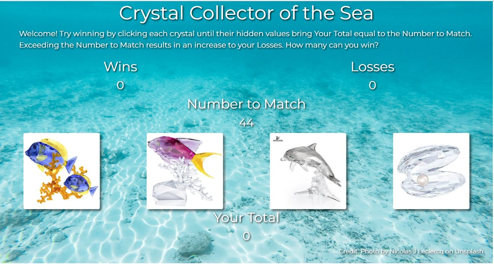

# Crystal Collector of the Sea
This is a front end game application built with Bootstrap & jQuery for dynamic responsiveness.

# How to Play
You are provided with a number to match and you do so by clicking four different crystal images.  Each image contains a hidden value which is added to your total.  If you match the number, you win!  If you go over the number, you lose.  You are then provided with a new number to match and new hidden values to try again.

# Benefits
Provides users with a game which requires strategy, memory, and calculations.

### [Play the Game!](https://Edestiny7.github.io/unit-4-game/)

Technology: HTML5 | CSS3 | JavaScript | jQuery Bootstrap | Google Fonts